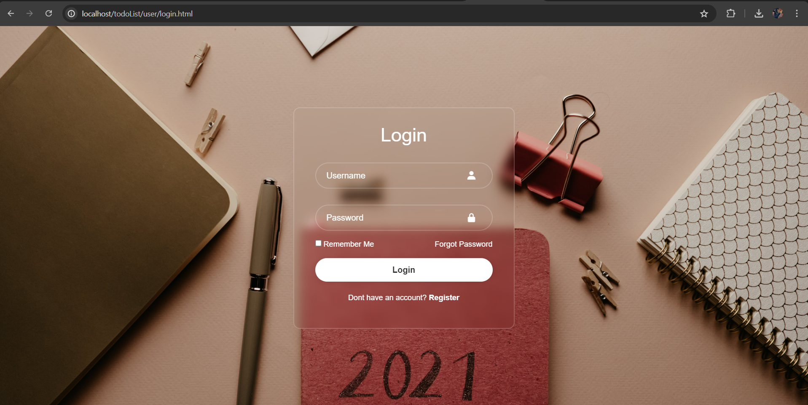
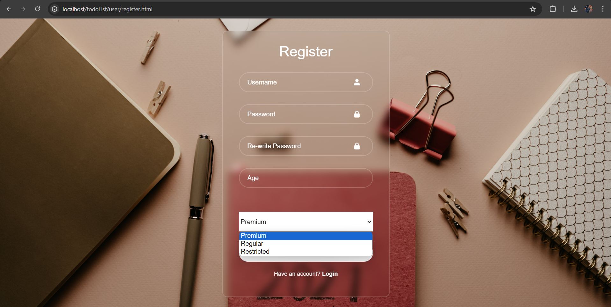
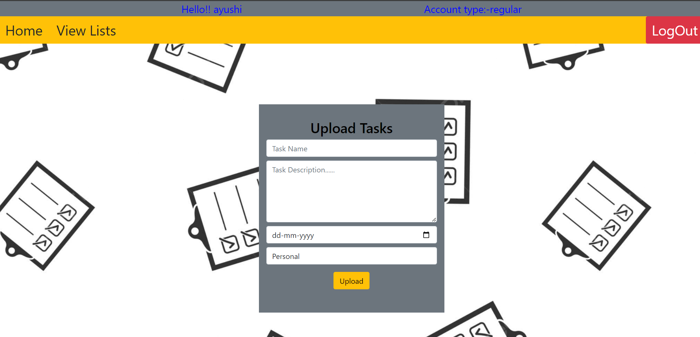
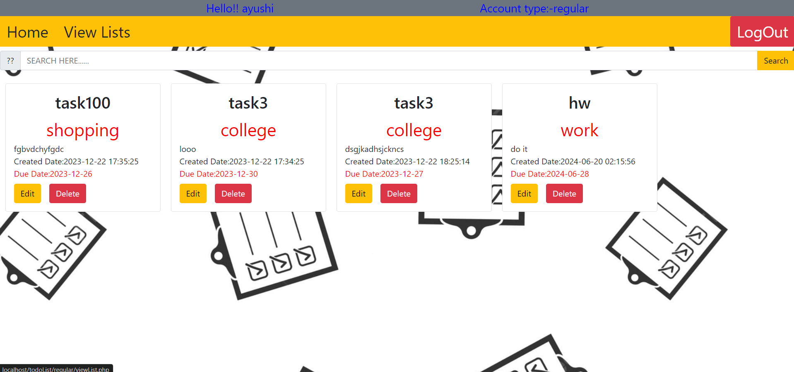
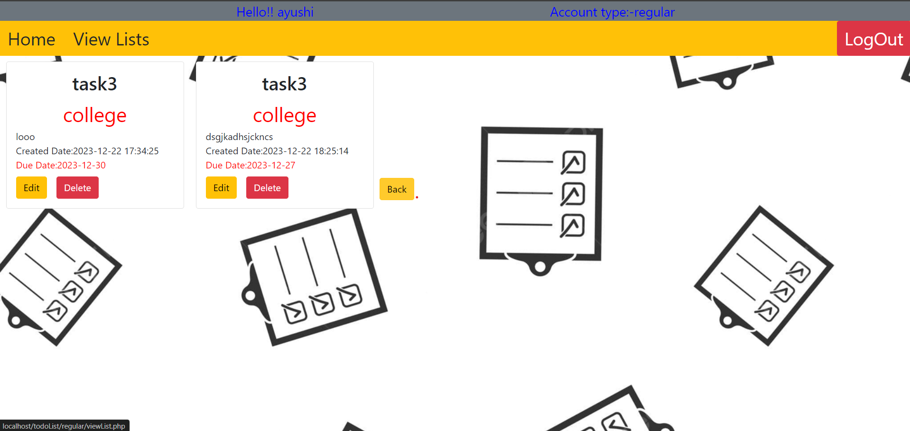

# To-Do-List
Introducing "ToDoList", a comprehensive task management system developed using HTML, CSS, JavaScript, PHP, MySQL, and XAMPP. This dynamic web application offers user registration and authentication with three distinct user types—Regular, Premium, and Restricted—each tailored with unique access privileges. Users can efficiently create, edit, and delete tasks, providing essential details such as task name, description, category (personal, college, shopping, etc.), and deadline date. The application facilitates seamless task viewing and searching, empowering users to filter tasks based on categories for enhanced organization. With personalized dashboards, users can access their tasks and manage profile settings effortlessly. Designed with a responsive interface, "ToDoList Plus" ensures optimal usability across devices, offering a user-friendly experience for organizing personal, academic, or shopping tasks effectively.
## Getting Started
### Creating a Folder
Copy entire file inside a folder named "todoList"
``` 
C:\xampp\htdocs\todoList
```
### Creating Database
Download Xampp Web Server
```
https://www.apachefriends.org/download.html
```
## Run the App
Start Apache and MySQL and
Run this URL
```
localhost/todoList
```
## Screenshop of the Website







